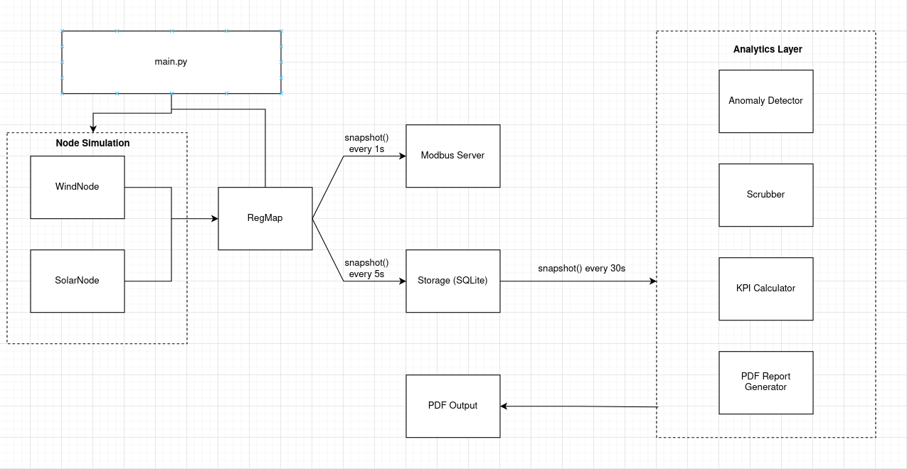

# SCADA Telemetry Emulator

A multi-threaded SCADA host emulator that generates realistic wind and solar telemetry data, serves it over Modbus TCP, and provides a full analytics pipeline with anomaly detection and PDF reporting.


## Features

- **Wind & Solar Telemetry Emulation**: Physics-based data models with realistic power curves, day/night cycles, and weather variability
- **50+ Real-Time Registers**: 5 wind turbines and 5 solar panels, each exposing 5 telemetry registers
- **Modbus TCP Server**: Industrial-standard protocol, queryable from any Modbus client or SCADA HMI
- **SQLite Data Logging**: Timestamped raw telemetry storage with WAL mode for concurrent access
- **Data Scrubbing**: Outlier detection (Z-score), negative power removal, and gap interpolation using Pandas/NumPy
- **KPI Computation**: Performance Ratio, Capacity Factor, and Availability calculated per node
- **Anomaly Detection**: Automated flagging of underperformance signatures (low power ratio, high temperature, voltage swing, string failures)
- **PDF Report Generation**: Multi-page reports with time-series charts, KPI summaries, and anomaly summaries


## Architecture



Each wind/solar node runs as a daemon thread writing to a shared thread-safe register map. The Modbus server reads from it for external clients. The logger writes to SQLite every 5 seconds. The analytics engine (scrub, KPI, anomaly) runs every 30 seconds. PDF reports are exported each analytic cycle.


## Components

### Telemetry Emulation
- **Wind Node**: Wind speed random walk with mean reversion, cubic power curve (cut-in 3 m/s, rated 12 m/s, cut-out 25 m/s), nacelle temperature model
- **Solar Node**: Sinusoidal irradiance with day/night cycle, cloud dips, cell temperature coefficient, DC voltage derating
- **Register Map**: Thread-safe shared dictionary with read/write/snapshot operations

### Modbus TCP Server
- pymodbus 3.13 with SimData/SimDevice API
- 500 holding registers per device
- Sync thread bridges register map to Modbus datastore every 1 second

### Storage
- **raw_telemetry**: Unmodified sensor readings with timestamps
- **clean_telemetry**: Scrubbed data with outlier/gap handling
- **metric_snaps**: KPI snapshots and anomaly flags per node per timestamp

### Analytics
- **Scrubber**: Z-score outlier flagging, negative power zeroing, linear interpolation of short gaps
- **KPI Calculator**: Performance Ratio (actual/theoretical), Capacity Factor (actual/rated), Availability (operating hours/total)
- **Anomaly Detector**: Rolling window analysis for low power ratio, low RPM under load, high temperature, voltage swing, thermal mismatch, string failure

### PDF Reports
- Title page with generation timestamp
- Per-node time-series charts (all 5 registers)
- KPI summary bar charts
- Anomaly flags summary chart


## Building

### Prerequisites

- Python 3.10+

### Setup

```bash
# Clone the repository
git clone <repo-url>
cd scada-emulator

# Create virtual environment
python3 -m venv .venv
source .venv/bin/activate

# Install dependencies
pip install -r requirements.txt
Running
python src/main.py
#This starts all 10 telemetry nodes, the Modbus TCP server on port 5020, the data logger, and the analytics engine. Press Ctrl+C to stop.

#Querying with a Modbus Client
#In a second terminal (with venv activated):
python -c "
from pymodbus.client import ModbusTcpClient
client = ModbusTcpClient('127.0.0.1', port=5020)
client.connect()
result = client.read_holding_registers(1, count=5, device_id=1)
print('Wind_01 registers:', result.registers)
client.close()
"
```

### Checking the Database
``` sql
sqlite3 output/scada.db "SELECT COUNT(*) FROM raw_telemetry;"
sqlite3 output/scada.db "SELECT DISTINCT node_id FROM raw_telemetry;"
sqlite3 output/scada.db "SELECT node_id, anomaly_flags FROM metric_snaps WHERE anomaly_flags != '[]' LIMIT 5;"
```

#### Configuration
All parameters are in config.yaml:
``` YAML
emulation:
  interval_seconds: 2      # Data generation rate
  wind_nodes:
    count: 5               # Number of wind turbines
  solar_nodes:
    count: 5               # Number of solar panels

modbus:
  port: 5020               # Modbus TCP port

database:
  batch_flush_interval: 5  # Seconds between DB writes

analytics:
  scrubbing:
    zscore_threshold: 3.0  # Outlier detection sensitivity
  anomaly:
    power_ratio_threshold: 0.6  # Underperformance threshold
```

# Project Structure
```
scada-emulator/
├── config.yaml
├── requirements.txt
├── schema.sql
├── src/
│   ├── main.py
│   ├── config.py
│   ├── emulation/
│   │   ├── register_map.py
│   │   ├── wind_node.py
│   │   └── solar_node.py
│   ├── modbus/
│   │   └── server.py
│   ├── storage/
│   │   ├── database.py
│   │   └── logger.py
│   ├── analytics/
│   │   ├── scrubber.py
│   │   ├── kpi.py
│   │   └── anomaly.py
│   └── reports/
│       └── pdf_export.py
└── output/
    ├── scada.db
    └── reports/